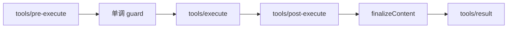

# Tool Pipeline：能力为什么不能直接等于权限

模型选择了一个工具，只说明它认为这个工具有帮助，不说明调用已经合法。把模型返回的 JSON 直接交给 `exec`，等于让概率性输出同时承担授权、参数校验、执行和审计，这是 Demo 进入生产后最危险的捷径之一。

## 一个工具有三个面

| 面 | 负责什么 | 主要消费者 |
| --- | --- | --- |
| 模型面 | 名称、说明和参数 Schema | System Prompt 与模型请求 |
| 执行面 | 参数校验、取消和真实副作用 | Tool Runtime |
| 投影面 | 规范值怎样变成模型内容和 UI 展示 | Session、模型和宿主 UI |

三者分开，才能避免执行器元数据、超时策略或 UI 卡片结构泄漏给模型。工具定义注册到 `ctx.tools` 后，注册行为属于当前 Fiber 的 Effect；插件卸载，工具也应从对应作用域消失。

## 注册位置决定可见范围

全局工具注册在根 Context，某个 Agent 专属工具则注册在它的局部 Context。工具限制可以进一步筛选继承来的全局能力。

这不是单纯的命名空间功能，而是最小权限设计：Subagent 不需要看到主 Agent 的全部工具，审计 Agent 也不应天然拥有写文件能力。能力组合首先发生在作用域中，执行授权随后仍要经过策略管线。

## 当前 `rc.8` 的执行管线

早期社区教程常把工具执行概括为四道闸门。当前官方 `rc.8` 把提交前的最后内容约束也明确纳入流程：

| 阶段 | 责任 | 典型行为 |
| --- | --- | --- |
| `tools/pre-execute` | 可扩展的前置决策 | allow、deny、ask、审批与沙箱策略 |
| 单调 Guard | 最终收紧权限 | 只能拒绝，后续插件不能重新放行 |
| `tools/execute` | 环绕真实分派 | 超时、重试、指标、取消信号包装 |
| `tools/post-execute` | 检查执行结果 | 接受、阻断、替换结果或追加上下文 |
| `finalizeContent` | 工具自有的末端内容不变量 | 对所有规范化结果做同步内容约束 |
| `tools/result` | 发布权威结果 | 只读观察已冻结、可持久化的最终结果 |

策略和机制因此可以独立演进。审批插件不需要理解 Bash 实现，超时插件也不需要被每个工具重复实现。

## 为什么 Guard 只能拒绝

前置 waterfall 允许灵活决策，但事件顺序可能变化。Guard 被设计成单调收紧：返回拒绝理由或不做决定，没有 allow 结果。新增一个安全规则只会缩小权限，不会被后注册的插件意外推翻。

代价是“允许”必须来自明确的基础策略或审批结果，不能靠一个万能监听器在最后偷偷放行。这正是安全组合需要的限制。

## 执行身份必须不可伪造

工具执行携带调用 ID、工具名、参数、所属 Agent、取消信号和运行时分配的不透明 token。参数在进入策略前经过无损 JSON 物化并冻结，工具不能改写“谁调用了我”；Code Mode 的嵌套调用还要携带父执行 token，保留调用树关系。

取消仍然是协作式的。工具必须观察或传递 `signal`，同进程运行时无法强制杀死一段拒不返回的 JavaScript。对不可信代码，真正的强隔离仍要靠 Worker、进程或 Sandbox，而不是 readonly 类型。

## 规范值、模型内容与 UI 展示

当前 API 对输出分层比早期教程更严格：

1. `execute` 返回可无损 JSON 化的规范值，并由 `output.schema` 校验。
2. `output.render` 把规范值投影成模型可见的 `ContentBlock[]`。
3. `presentationMeta`、`presentCall` 和 `presentResult` 为 UI 生成可回放展示。

规范值是执行期结果，当前 `rc.8` 明确不把它直接写入持久事件；日志保存模型可见内容和可选展示元数据。展示函数必须是纯函数，因为实时 UI 和会话回放都会调用它们。这样 UI 格式不会污染模型协议，回放也不会因为时钟、随机数或 I/O 得到另一张卡片。

## 并发默认保守

一次模型回复可能请求多个工具。只有工具显式判定当前参数可以并发时，调用才进入 parallel 组；遗漏、异常或非 `true` 结果都按 exclusive 处理。独占调用形成顺序屏障，避免写文件、Shell 或共享状态操作被盲目并发。

并发声明只是调度承诺，不是自动线程安全。工具作者仍要保证共享状态可并发，结果提交顺序也要保持可解释。

## 设计检查

- 工具注册在哪个 Context，哪些 Agent 实际可见？
- 参数、身份和取消信号是否在策略前冻结并贯穿执行？
- deny、ask、timeout、abort、无效输出是否得到不同的失败事实？
- 规范值、模型内容和 UI 展示是否被错误混为一层？
- 并发安全是显式证明，还是默认猜测？
- `tools/result` 发布后，是否还有插件能修改权威结果？

事实基线见官方 [Tools Subsystem](https://github.com/deepseek-ai/deepseek-harness/blob/dsh-v0.1.0-rc.8/docs/subsystems/tools.zh.md) 与 [Tool Execution Pipeline](https://github.com/deepseek-ai/deepseek-harness/blob/dsh-v0.1.0-rc.8/docs/tool-execution-pipeline.zh.md)。

## 小结

- 能力可见、执行授权和真实副作用是三层不同责任。
- `rc.8` 的管线在三条 waterfall 与 Guard 之后，还有工具自有 Finalizer 和只读结果通知。
- 执行身份、参数和最终结果被冻结，取消信号则必须由工具协作遵守。
- 规范值、模型内容和 UI 展示分层，才能兼顾校验、上下文与回放。

下一篇建议继续看：

- [Session Log：为什么日志就是事实源](../07-session-log/index.html)
