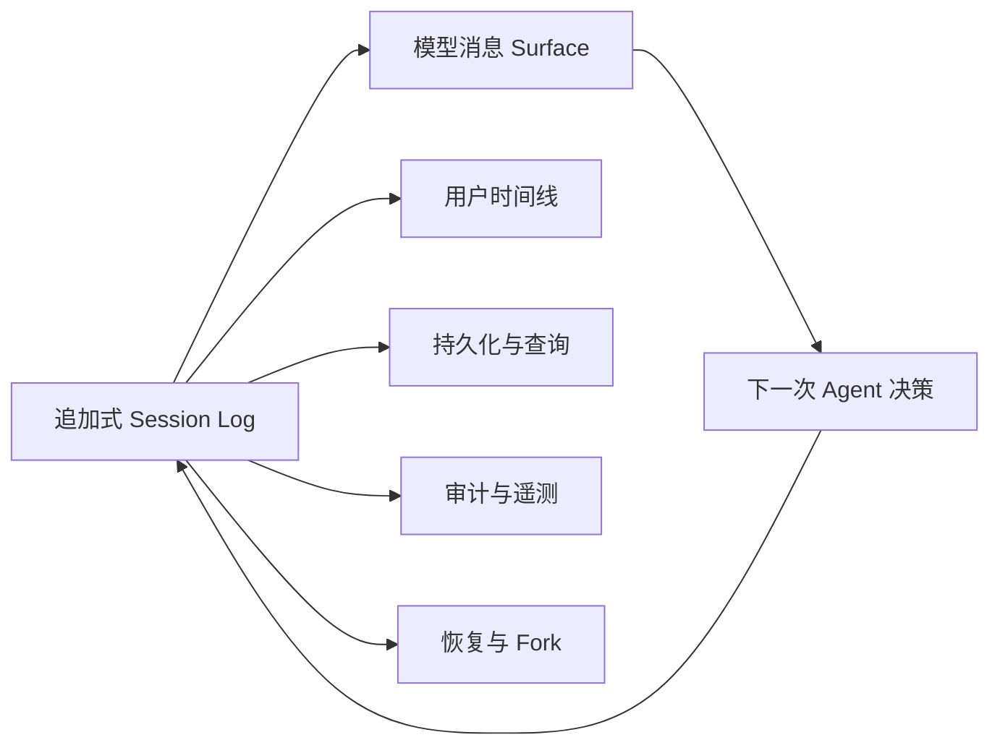

# Session Log：为什么日志就是事实源

一个可变的 `messages` 数组只能告诉你现在看到了什么，不能告诉你为什么会变成这样：用户何时插话，模型何时请求工具，审批是否拒绝，某个进程是超时还是被取消。长任务一旦需要恢复、Fork 和审计，可变数组就不够了。

## 一条铁律：模型可见即已记录

DSH 的核心不变量是：任何进入模型请求的内容，都必须能从 Session Log 重建。请求不是内存中临时拼出的另一个事实源，而是日志的确定性投影。

这条规则直接排除了“在发送前偷偷加一句 Prompt”的做法。新的上下文注入机制必须先让日志能够表达这项事实，再让模型消息投影读取它；否则恢复后的模型会看到不同世界。

## 保存事实，派生视图

Session 是类型化的追加式事件序列。每条事件包含连续递增的 `seq`、时间、事件类型和可无损 JSON 化的数据；写入后不原地修改。

| 事实类型 | 记录什么 | 是否直接进入模型 Surface |
| --- | --- | --- |
| `turn/*`、`step/*` | 控制边界和结束原因 | 否 |
| `user/message` | 人类输入、系统注入或目标续接 | 是 |
| `assistant/chunk` | 原始流式增量 | 否，用于保真回放 |
| `assistant/message` | 一次组装完成的模型消息与用量 | 是 |
| `tool/call` | 模型请求的原始工具名和参数字符串 | 否，调用内容由 assistant 消息表达 |
| `tool/result` | 最终模型可见结果与失败信息 | 是 |
| `request/header` | Provider、模型和请求配置快照 | 否，用于重建请求 |

`assistant/chunk` 和 `assistant/message` 同时存在不是重复存储：前者保留实时输出过程，后者提供稳定的模型历史。`sourceEventSeqs` 可以指出完整消息由哪些早期事实形成，让回放和追责不依赖猜测。

## Surface 不是另一份可变消息数组

`deriveMessages()` 按日志中的 Surface 规则投影当前模型历史。普通消息使用 append；上下文压缩则用 replace 操作让新摘要遮蔽一段旧 Surface，并引用所有被替换的来源事件。

旧事件仍在日志里，只是不再出现在当前模型工作集中。这样既能控制上下文长度，又能解释摘要替换了什么。压缩不是删除事实，而是发布一个新的可验证视图节点。

投影结果和 Loop 请求会被冻结。默认 Loop 的不变量会比较实际请求与 `deriveMessages()`，从运行时阻止日志外的模型可见状态。

## Fork 是选择一个稳定前缀

`ctx.sessions.fork(source, boundary?, childSessionId?)` 从活跃会话复制一个连续前缀，并记录父会话和种子长度。边界必须位于没有开放 Turn 的稳定位置；如果指定位置仍处在执行中，API 会拒绝，而不是静默截断出一个悬空历史。

Fork 后，父子会话共享过去的事实副本，各自追加新的事件。Subagent 可以在此基础上继承必要上下文，又不会与父会话争写同一个日志尾部。

## 一次写入，多方消费

Session Log 是事实层，不等于某一种数据库：

| 层 | 责任 |
| --- | --- |
| Session Log | 定义事件语义、顺序和 Surface 投影 |
| Persistence | 把日志写入 JSONL、SQLite 或其他后端 |
| Query / Projection | 为 UI 和检索建立高效视图 |
| `session/event` | 向持久化、遥测、审计等观察者广播新事实 |

把“什么是真的”和“事实存在哪里、怎样查询”分开，才能替换持久化而不改变 Agent 记忆语义。监听器是消费者，不应该反向修改已经提交的事件。

## 这套设计的代价

- 事件词汇和迁移策略必须版本化；当前官方格式仍是预发布版本，不承诺长期兼容。
- 日志只增不改会持续增长，需要持久化、索引和归档策略。
- 未识别的必需事件不能被静默跳过，否则恢复可能得到错误状态；只有明确标记为可忽略的事件才能安全忽略。
- Event Sourcing 能说明发生过什么，却不能自动撤销外部副作用，补偿动作仍需单独设计。
- Fork 复制事实前缀，不等于复制所有进程内资源或 Provider 私有状态。

事实基线见官方 [Architecture](https://github.com/deepseek-ai/deepseek-harness/blob/dsh-v0.1.0-rc.8/docs/architecture.zh.md)、[Session Subsystem](https://github.com/deepseek-ai/deepseek-harness/blob/dsh-v0.1.0-rc.8/docs/subsystems/session.zh.md) 与 [Persistence Catalog](https://github.com/deepseek-ai/deepseek-harness/blob/dsh-v0.1.0-rc.8/docs/persistence-catalog.zh.md)。

## 小结

- Session Log 是唯一事实源，模型历史、UI、恢复、Fork 和审计都是其投影或消费者。
- “模型可见即已记录”让请求可以重建，也禁止日志外的隐式 Prompt 注入。
- Surface replace 让压缩遮蔽旧消息而不删除历史事实。
- 持久化和查询是可替换存储层，不定义 Agent 到底记得什么。

下一篇建议继续看：

- [Inbox 控制：为什么用户插话必须有自己的语义](../08-inbox-control/index.html)
