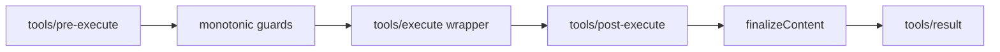

# Tool Pipeline：一次工具调用经过哪些门

工具调用不是模型吐出 JSON 后直接 `exec`。在可治理的 Harness 中，一次调用要经过参数校验、策略判断、执行包装、结果渲染和日志记录。每一步都应该能观测、取消和测试。

## 当前执行路径



`tools/pre-execute` 是 waterfall，可以标准化参数或提前拒绝；守卫只能 deny 或 abstain，不能绕过策略强行 allow。执行包装器统一处理 `AbortSignal`、异常和耗时。最后由 `ToolDefinition.finalizeContent` 把内部值变成模型可见的 `ContentBlock[]`。

## 定义与执行分离

```ts
const definition = {
  name: 'read_file',
  description: '读取一个受策略约束的文件',
  inputSchema,
  execute: async (input, { signal }) => readFile(input.path, { signal }),
  render: (args, value) => [{ type: 'text', text: summarize(value) }],
}

ctx.tools.register(definition)
```

`execute` 处理真实副作用，`render` 决定模型看到的内容。不要把完整二进制、密钥或巨大日志直接放进上下文；需要保留原始产物时使用 spill/store，再在结果中返回引用。

官方入口：[Tools Subsystem](https://github.com/deepseek-ai/deepseek-harness/blob/dsh-v0.1.0-rc.8/docs/subsystems/tools.zh.md) 和 [Tool Execution Pipeline](https://github.com/deepseek-ai/deepseek-harness/blob/dsh-v0.1.0-rc.8/docs/tool-execution-pipeline.zh.md)。
