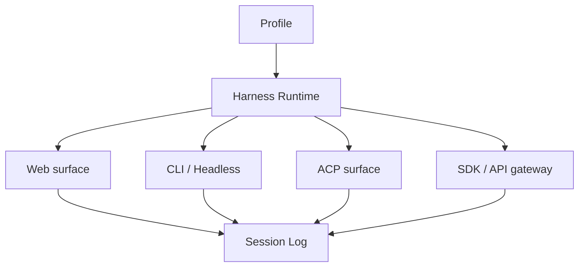

# Runtime Surfaces：Web、Headless、ACP 与 SDK

同一个 Harness 可以被 Web UI、CLI、自动化任务或另一个 Agent 调用。它们共享服务和会话语义，但不共享生命周期：Web 需要连接管理，Headless 需要退出码，ACP 需要协议握手，SDK 需要把取消和错误传回调用者。

## 运行面分层

运行面不应该各自实现一套 Agent Loop。它们共享 `ctx.sessions`、`ctx.agents`、`ctx.approval` 和观测事件，只在输入适配、认证、流式传输和断线恢复上有差异。

## 选择宿主的三个问题

1. 客户端断线后，Turn 是否继续，如何重新订阅日志？
2. 谁拥有审批和凭据，宿主还是远端调用者？
3. 运行面暴露的是单次 `run`、会话流，还是可管理的后台 Job？

官方仓库当前的包和 Profile 会随 release 变化，不能只依据社区文章里的目录截图。先看 [Architecture](https://github.com/deepseek-ai/deepseek-harness/blob/dsh-v0.1.0-rc.8/docs/architecture.zh.md)，再用 `dsh --profile <name> --dump-config` 确认本地组合。

## 学完后的落点

你应该能画出从客户端输入到 Session Log、Agent Loop、Tool Pipeline、Approval 和 Sandbox 的边界，并指出每个边界的事实源、取消方式、失败分类和权限责任。这比记住某个 CLI 参数更能迁移到其他 Harness 或自研运行时。
