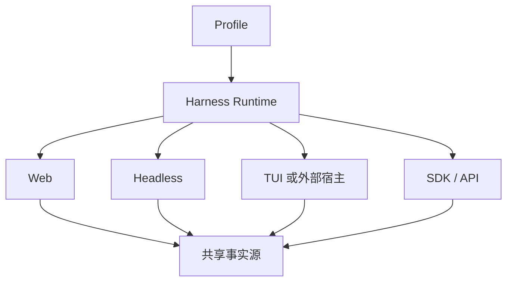

# Runtime Surfaces：一套运行时如何服务多个宿主

DSH 同时有两个身份：它是一套可以直接运行的 Coding Agent，也是一套 Agent 开发框架。官方 Web 和 headless 可以看成官方已经拼好的两辆车；TUI、自动化任务或其他交互方式，则可以通过外部 Profile 和插件接入同一个运行时。

## 设计理念：运行时稳定，表面可替换

Web、CLI、headless、ACP 或 SDK 的输入输出不同，但不应该各自实现一套 Agent Loop。它们共享会话、事件、工具和策略，只在连接管理、认证、流式传输、断线恢复和退出码上有差异。

## 如何理解官方实现的边界

如果用 Coding Agent 的产品标准比较，早期 DSH 的交互体验、插件质量和接口稳定性未必能与成熟产品相比。这并不否定它的价值：作为开发框架，它更像一套乐高零件和组合规则，官方产品只是其中一套预置拼法。

换引擎、工具、文件系统、沙箱、会话存储或 UI，最后拼出来的甚至不一定还是 Coding Agent。这种自由度带来的代价是生态质量不齐、接口持续变化和组合错误增多，使用时必须固定 Profile、版本和权限边界。

## 什么时候应该选择 DSH

如果目标只是增加搜索、Skill 或少量 Hook，声明式扩展加短暂重启通常更便宜。若目标是研究可替换 Agent Loop、运行时组合多个产品形态、动态装配有状态能力，或者为自进化探索提供物理插槽，DSH 才真正体现差异。

它不会自动让模型更聪明，也不保证日常 Coding 体验超过成熟产品。它提供的是一个更高的 Harness 可变上限，并把生命周期、兼容性、权限和生态治理的复杂度一起交给开发者。

参考官方 [Architecture](https://github.com/deepseek-ai/deepseek-harness/blob/dsh-v0.1.0-rc.8/docs/architecture.zh.md)。函数式编程风格的阅读线索可参考用户提供的 [DeepSeek Harness Agent OS](https://blog.anionex.me/archives/deepseek-harness-agent-os) 文章；由于该页面当前无法通过检索服务稳定读取，本文不把其中的实现判断当作官方 API 事实。

下一篇建议继续看：本模块已结束，可回到 [DeepSeek Harness 总览](../index.html) 按设计问题复习。
