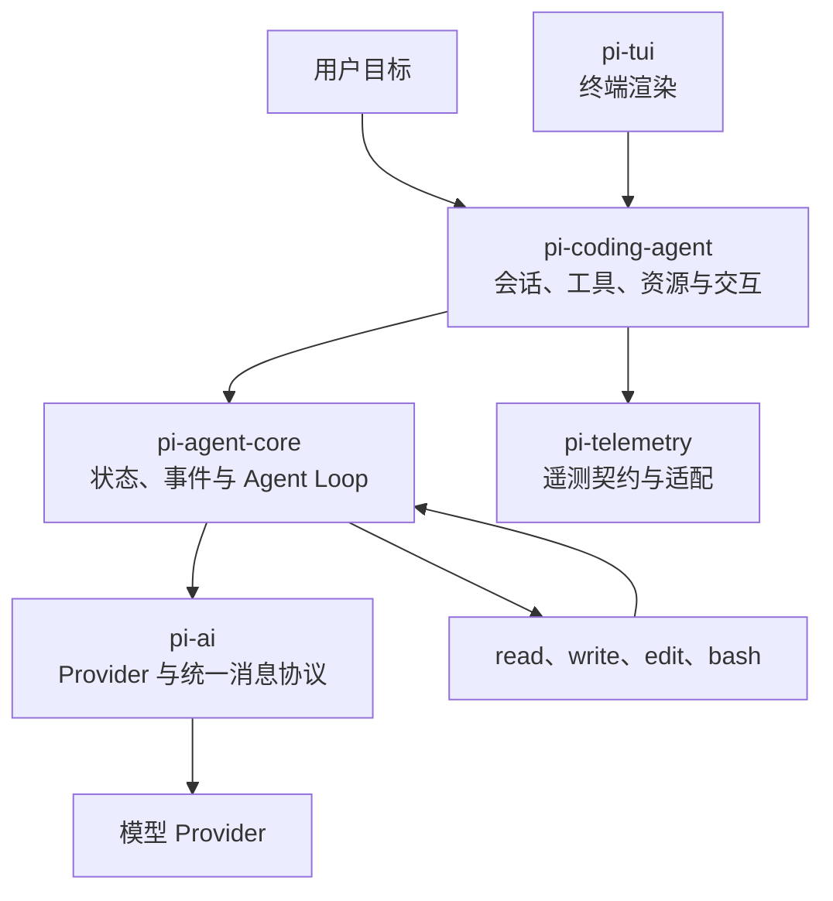

# Pi 是什么：定位、架构与 Agent Loop

## 为什么这个问题值得关注

把 Pi 只理解成“终端里的聊天工具”，会看不到它真正有价值的部分：一套可以单独使用、嵌入应用、替换模型并扩展运行行为的 Agent Harness。反过来，把它描述成“什么都不做的四包小内核”，又会漏掉 Session、Compaction、RPC、SDK 和项目资源加载这些已经存在的能力。

更可靠的理解方法是追踪一次完整工具往返：谁产生意图，谁执行环境动作，哪条结果成为下一轮模型事实，以及哪一层负责把这些对象保存下来。

> 本文基于官方仓库 commit [`a470b121`](https://github.com/badlogic/pi-mono/tree/a470b121bf683b4c2b9fc0b3a7c807de7e0cfe9c)。包和 API 会变化，职责边界比数量更稳定。

## Pi 解决什么问题

Pi 的官方定位是 minimal agent harness。翻译成工程职责，它需要完成：

- 把用户目标、项目上下文和可用工具组织成模型请求；
- 接收流式模型事件，把 tool call 转成真实工具执行；
- 将 tool result 追加回消息序列，继续下一轮模型请求；
- 保存 Session，使任务可以恢复、分支和压缩；
- 通过 Skill、Extension、Prompt Template 和 Package 适配不同工作流；
- 通过 TUI、JSON、RPC 和 SDK 服务不同宿主。

Pi 同时明确不内置 MCP、subagent、权限弹窗、plan mode、todo 和 background bash。这些不是“做不到”，而是官方不愿替所有用户规定唯一实现。你可以用 Extension 或 Package 增加它们，也可以继续使用 CLI、容器和 tmux 等外部能力。

## 当前源码中的职责层

当前 monorepo 对外发布五个主要包。下图是职责图，不是逐函数调用图：



| 包 | 稳定职责 | 不应误解为 |
| --- | --- | --- |
| `@earendil-works/pi-ai` | 模型目录、统一消息、流式事件、Provider 适配 | 完整 Agent Runtime |
| `@earendil-works/pi-agent-core` | 有状态 Agent、工具执行、事件流和 Loop | Coding Agent 产品外壳 |
| `@earendil-works/pi-coding-agent` | CLI、Session、资源加载、内置工具、Extension、SDK/RPC | 只有 TUI 的命令行程序 |
| `@earendil-works/pi-tui` | 差分终端渲染和交互组件 | 模型决策层 |
| `@earendil-works/pi-telemetry` | 厂商无关的遥测契约和适配器 | 安全审计系统 |

仓库里还存在 protocol、client、server、session backend 等内部或专项包。因此，学习当前源码时不应再用固定“四包架构”概括全部实现。

## 一次 README 请求为什么会调用模型两次

用户要求“读取 README 并概括项目”时，模型第一次并不知道文件内容。最小闭环如下：

```text
用户消息
  -> 第一次模型调用
  -> assistant message 提出 read(toolCallId=call_1)
  -> Agent Loop 执行 read
  -> tool result 返回文件内容(toolCallId=call_1)
  -> 第二次模型调用
  -> assistant message 给出最终回答
```

这里有三种不同责任：

1. **模型负责提出动作**：tool call 只表示“模型想读取”。
2. **Loop 负责调度动作**：根据工具名定位实现、校验参数、处理并发与取消。
3. **工具负责产生环境事实**：tool result 才能证明读取成功、失败或被中止。

`toolCallId` 把意图与结果配成一对。如果只保存 tool call 和最终文本，却丢掉 tool result，系统无法证明文件真的被读取过。这也是《动手学 Pi》序章最值得保留的观察方法：先问每条事实由谁产生，再判断它是否应该进入长期 transcript。

## 运行事件和持久消息不是一回事

`pi-agent-core` 对外发送的事件比教材的七个抽象里程碑更完整。一次带工具的请求大致经过：

```text
agent_start
turn_start
message_start / message_update / message_end
tool_execution_start / tool_execution_update / tool_execution_end
message_start / message_end          # toolResult message
turn_end
turn_start                           # 带着工具结果再次请求模型
message_start / message_update / message_end
turn_end
agent_end
```

这些事件适合驱动 TUI、日志和外部宿主，但并非全部都要进入模型上下文。长期事实主要保存在结构化消息和 Session entry 中：

- `user`：用户目标和后续指令；
- `assistant`：完整文本、thinking 和 tool call；
- `toolResult`：与 call id 配对的结果、错误标记和 details；
- Session 中的模型切换、compaction、branch summary、label 与 Extension entry。

“UI 上显示过”不等于“下一轮模型能看到”，“最终回答提到成功”也不等于“工具事实证明成功”。这两个区分是调试 Agent Loop 的起点。

## 并行工具带来的顺序问题

当前 `pi-agent-core` 默认支持并行工具执行。并行时需要区分两个顺序：

- `tool_execution_end` 按真实完成时间发出，快工具可能先结束；
- 持久化的 tool result 仍按 assistant message 中 tool call 的原始顺序追加。

这种设计同时满足实时 UI 和稳定 transcript。若直接把“完成事件顺序”当作“消息顺序”，相同任务可能在每次运行中产生不同的上下文，测试和恢复都会变得不稳定。

工具失败也必须形成配对结果。参数无效、工具不存在、实现抛错、超时和取消不能让 call 悬空，否则后续模型既不知道发生了什么，也无法可靠恢复。

## Pi 不只在终端中运行

| 模式 | 入口 | 适合场景 | 宿主额外责任 |
| --- | --- | --- | --- |
| Interactive | `pi` | 人持续在环的开发任务 | 审批、观察和最终验证 |
| Print / JSON | `pi -p`、`--mode json` | Shell 脚本、CI、事件采集 | 退出码、结构化输出和超时 |
| RPC | `pi --mode rpc` | Python、Go、编辑器或独立进程集成 | JSONL framing、进程生命周期、取消 |
| SDK | `createAgentSession()` | Node.js 应用内嵌 | Session、凭据、工具与并发管理 |

TUI 只是 `pi-coding-agent` 的一个产品入口。判断 Pi 是否能嵌入你的系统，应查看 RPC/SDK 契约，而不是根据“terminal coding harness”推断它只能在终端使用。

## 用 JSON 模式观察真实闭环

在临时仓库中执行一个只读任务：

```bash
pi --mode json "读取 README.md，只报告第一行" 2>/dev/null \
  | jq -c 'select(.type | startswith("tool_execution"))'
```

你应当看到同一个 `toolCallId` 出现在 `tool_execution_start` 和 `tool_execution_end`。然后把文件名改成不存在的路径，观察结束事件和 tool result 如何表达错误。

这个实验不要求记住所有事件名。它要验证的是四个不变量：

1. tool call 与 result 能配对；
2. 工具错误不会伪装成正常文本；
3. 结果会进入下一轮模型请求；
4. 运行结束后，文件系统状态仍需独立验证。

## 从哪里继续读源码

| 问题 | 当前源码入口 |
| --- | --- |
| Agent 事件、工具并发与 Loop | `packages/agent/src/` |
| Message、Model、Provider 与流式协议 | `packages/ai/src/types.ts`、`packages/ai/src/api/` |
| CLI 到 Session 的组合入口 | `packages/coding-agent/src/main.ts` |
| Session 与 JSONL entry | `packages/coding-agent/src/core/session-manager.ts` |
| SDK 创建会话 | `packages/coding-agent/src/core/sdk.ts` |
| Extension 类型与事件 | `packages/coding-agent/src/core/extensions/types.ts` |

源码路径比博客中的包数量更适合作为事实锚点。升级后若文章结论与类型定义冲突，应以当前类型、测试和可执行行为为准。

## 最小内核的收益与代价

Pi 的收益不是“功能最少”，而是工作流偏好较少写死在核心里。你可以只使用 `pi-ai`，也可以通过 SDK 嵌入 Session，或者用 Extension 修改工具和事件行为。

代价同样明确：

- 没有内置 sandbox，进程权限就是最大影响范围；
- Extension 与 Package 是同进程可执行代码，需要自行审计；
- 很多产品能力有多种社区实现，团队必须选择并维护组合；
- Provider 和扩展 API 迭代较快，固定版本与回归测试不可省略。

因此，“可扩展”不自动等于“生产可用”。生产系统仍要回答隔离、审计、恢复、升级和评测由谁负责。

## 小结

- Pi 是可组合 Agent Harness，不只是终端聊天界面。
- 当前主线由 `pi-ai`、`pi-agent-core`、`pi-coding-agent`、`pi-tui` 和 `pi-telemetry` 等包分工完成。
- tool call 是模型意图，tool result 才是环境事实，两者必须用 call id 配对。
- 运行事件服务 UI 与宿主，Session 和消息保存可恢复事实，二者不能混用。
- Pi 原生支持 Session、JSON、RPC 和 SDK，但安全隔离仍需由外部系统提供。

---

下一篇建议继续看：[pi-ai：统一多 Provider 的适配层设计](../02-pi-ai-provider/index.html)
