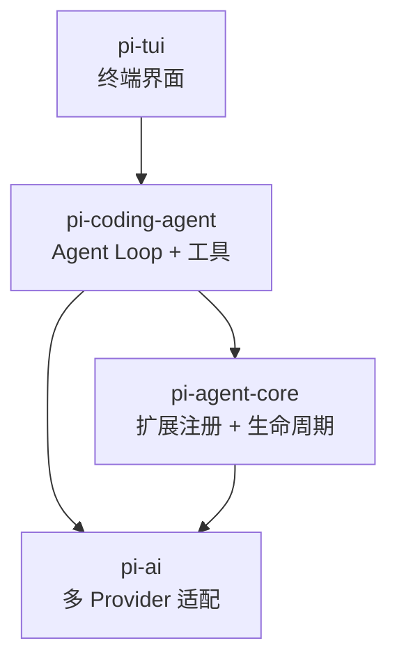

# Pi 是什么：定位、架构与安全模型

## 为什么这个问题值得关注

Coding Agent 框架正在分化成两条路线。一条是重运行时路线：内置权限系统、沙箱、审批流、会话恢复，把安全和控制编码进框架本身（Claude Code、DeepSeek Harness 属于这一类）。另一条是轻内核路线：框架只负责循环和工具调度，安全由外部基础设施承担。

Pi 是轻内核路线目前星数最高（GitHub ~95k）、生态最活跃的代表。理解它的设计选择，能帮你判断什么时候该选轻量方案，什么时候轻量方案的假设会失效。

仓库地址：[earendil-works/pi](https://github.com/earendil-works/pi)（原 badlogic/pi-mono，由 Mario Zechner 创建）。

## Pi 解决什么问题

Pi 的定位是 **minimal terminal coding harness**。翻译成工程语言：

- 提供一个 Agent Loop，驱动模型持续调用工具直到任务完成
- 提供一套扩展机制，让社区贡献工具、命令和 UI 组件
- 提供一个统一的多 Provider 适配层，屏蔽不同模型 API 的差异
- 不提供权限管理、沙箱隔离、审批流程

最后一条不是遗漏，是设计选择。Pi 的 README 明确声明：不限制文件系统、进程、网络和凭据访问。

"minimal"不是"功能少"。Pi 通过扩展体系覆盖了文件操作、Shell 执行、代码搜索、Web 抓取、MCP 工具代理等大量能力。但这些能力都不在内核里——它们是可以被移除、替换或增强的扩展。

## 四包架构

Pi 采用 TypeScript monorepo 结构，npm 包以 `@earendil-works/pi-*` 发布。核心由四个包组成：

### pi-agent-core

扩展注册、生命周期管理、事件总线。定义了三层能力抽象：

- **Extension**：工具、命令、事件监听、自定义 UI 组件
- **Skill**：可复用的按需能力，Agent 根据任务动态加载
- **Package**：打包分享 extensions、skills、prompts 和 themes 的分发单元

`pi install` 命令安装扩展，生态通过 Package 分享。

### pi-ai

统一 Provider API。一个接口覆盖 OpenAI、Anthropic、Google、Bedrock，消费者不感知底层差异。这意味着切换模型只需要改配置，不需要改代码逻辑。

### pi-coding-agent

Agent Loop 实现、内置工具集（文件读写、Shell 执行、搜索等）、Prompt 组装。这是用户直接交互的层——接收任务、驱动循环、返回结果。

### pi-tui

终端 UI 层，渲染模型输出、工具调用进度、用户输入。Pi 是终端原生的，不绑定任何 IDE。与 Cursor 的区别在这里：Cursor 是编辑器内的 Agent，Pi 是终端里的 Agent。

### 职责边界

四个包的职责边界清晰：pi-ai 不知道 Agent 概念，pi-agent-core 不知道模型协议，pi-tui 不参与决策。这让每一层可以独立替换——你可以只用 pi-ai 做模型适配而不用 Pi 的 Agent Loop，也可以用 Pi 的扩展体系但接入自己的模型层。

## 安全模型：不内置权限意味着什么

Pi 不做任何运行时权限检查。模型决定执行 `rm -rf /` 时，Pi 会忠实执行。

这不是安全意识缺失，而是一个显式的架构判断：**安全应该由运行环境保证，而不是由 Agent 框架保证。** Pi 推荐的隔离方式：

| 隔离方案 | 机制 | 适合场景 |
| --- | --- | --- |
| Gondolin micro-VM | 轻量虚拟机，毫秒级启动 | 生产环境、多租户 |
| Docker 容器 | 文件系统和网络隔离 | 开发环境、CI/CD |
| OpenShell sandbox | 进程级沙箱 | 本地实验 |

### 这个选择背后的工程逻辑

权限系统不是免费的。一旦框架内置权限检查，就需要：

- 定义权限模型（文件、网络、进程分别怎么控制）
- 维护白名单和规则引擎
- 让扩展开发者为每个工具声明所需权限
- 处理权限冲突和升级场景
- 为用户提供权限配置界面

这些代码加起来可能比 Agent Loop 本身还多。Pi 的判断是：这些复杂度应该由专业的隔离方案承担（操作系统、容器运行时、虚拟机），而不是由一个 Agent 框架重新发明。

### tradeoff 的两面

**收益：**

- 框架代码更少、更简单、更容易审计
- 不需要维护复杂的权限规则和白名单
- 扩展开发者不需要处理权限声明，降低贡献门槛
- 用户可以选择自己信任的隔离方案，不被框架绑定

**代价：**

- 裸机运行时没有任何安全网——模型幻觉可能导致破坏性操作
- 安全责任完全转移到使用者，增加了部署门槛
- 无法在框架层面提供细粒度的工具审批（"允许读文件但不允许删除"）
- 企业合规场景需要额外的基础设施层
- 新手用户可能不理解裸机运行的风险

### 与竞品的安全模型对比

**Claude Code** 的做法：内置权限系统，每个工具执行前可以拦截和审批，沙箱模式限制文件系统访问范围。代价是框架更复杂，扩展开发需要声明权限，但用户在裸机上也能获得基本安全保障。

**DeepSeek Harness** 的做法：策略平面 + Approval 插件，权限规则本身可替换。复杂度最高，但灵活性也最高——你可以换掉整个审批逻辑而不改动 Agent Loop。

三者没有绝对优劣。关键变量是部署环境：

- 有容器化平台 -> Pi 的假设成立
- 裸机 + 需要安全 -> Claude Code 更稳妥
- 需要可编程的策略 -> DSH 更合适

## 什么时候该选 Pi

适合 Pi 的场景：

- 你已经有容器化基础设施（Kubernetes、Docker Compose），安全由平台层保证
- 你需要对接多个模型 Provider，不想被单一厂商锁定
- 你需要高度定制的工具和工作流，框架本身不应该限制你
- 你的团队有能力维护 TypeScript 扩展，并且愿意接受社区生态的不确定性
- 终端原生工作流，不需要 IDE 集成
- 你想利用 pi-skills 的跨框架兼容能力（同一个 Skill 可以在 Claude Code、Codex CLI、Amp、Droid 中运行）

## 什么时候不该选 Pi

- 你在裸机或共享开发机上运行，没有容器化环境——缺少安全边界，一次模型幻觉就可能造成不可逆损害
- 你需要开箱即用的权限管理和审批流程——Pi 不提供，你得自己建或者用社区方案
- 你的团队对 TypeScript 生态不熟悉——扩展开发、调试、依赖管理都在这个技术栈里
- 你需要稳定的长期支持——Pi 迭代快，breaking changes 频繁，升级成本不低
- 企业合规要求框架层面的访问控制审计——需要额外建设，Pi 本身不产生审计日志
- 你需要会话恢复、长任务断点续传——Pi 的内核不提供这些（需要扩展或自己实现）

## 与其他框架的定位对比

| 维度 | Pi | Claude Code | DeepSeek Harness |
| --- | --- | --- | --- |
| 定位 | 最小终端 Harness | 内置安全的 Coding Agent | 可组合 Agent Runtime |
| 安全模型 | 外部容器化 | 内置权限 + 沙箱 | 策略平面 + Approval |
| Provider 支持 | 多 Provider（pi-ai） | Anthropic 优先 | 多 Provider（适配器注册） |
| 扩展机制 | Extension + Skill + Package | Skills + Hooks | Cordis 插件树 |
| 内核复杂度 | 低 | 中 | 高 |
| 裸机安全性 | 无 | 有 | 有 |
| IDE 集成 | 无（终端原生） | VS Code 集成 | Web + headless |
| 会话恢复 | 不内置 | 内置 | 内置（Session Log） |

这张表不是评分卡。每一行的选择背后都有工程代价——内核复杂度高意味着更难审计和贡献，裸机安全性有意味着框架代码更多。选择框架时要看的不是哪个"更好"，而是哪个的假设和你的环境最匹配。

## 小结

Pi 的核心设计判断是：Agent 框架应该尽可能小，安全交给基础设施，功能交给扩展。这个判断在容器化环境下成立，在裸机环境下危险。

理解这个边界条件，比记住任何 API 都重要。当你评估一个 Agent 框架时，第一个问题不是"它有多少功能"，而是"它假设了什么运行环境"。Pi 假设你有容器化隔离。如果你没有，Pi 的简洁就变成了风险。

---

下一篇：[pi-ai：统一多 Provider 的适配层设计](../02-pi-ai-provider/index.html)
