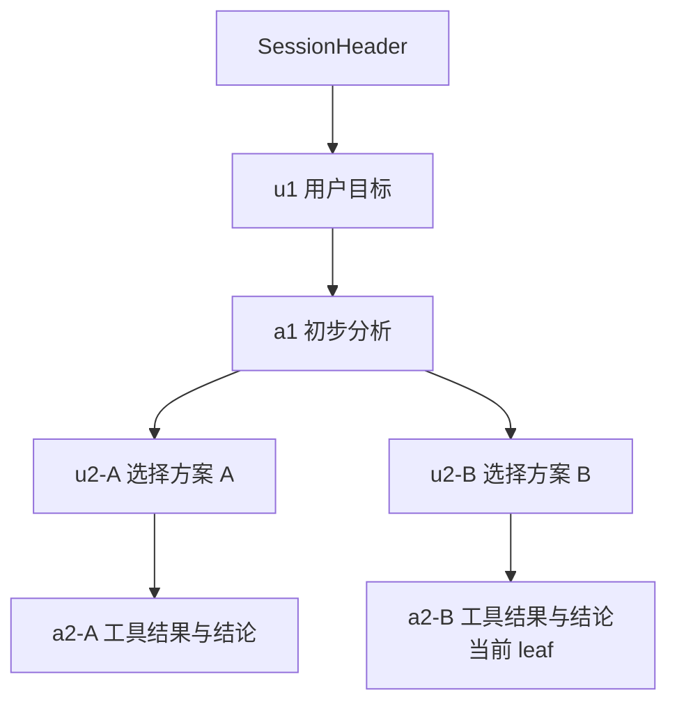

# Session Runtime：树形历史、恢复与 Compaction

## 为什么这个问题值得关注

长任务真正困难的不是“把聊天文本保存到文件”，而是恢复到一个仍能继续工作的状态：用户目标、工具事实、模型选择、活动分支、关键决策和未完成步骤都不能凭空丢失，过长日志又不能原样塞进每次模型请求。

Pi 把 Session 保存成 JSONL 树，并把持久历史、活动路径和模型 Context 分开处理。理解这三层后，`/resume`、`/tree`、`/fork`、`/clone` 和 `/compact` 才不会变成一组孤立命令。

> 本文基于官方 [Sessions](https://pi.dev/docs/latest/sessions)、[Session Format](https://pi.dev/docs/latest/session-format)、[Compaction](https://pi.dev/docs/latest/compaction)、[RPC](https://pi.dev/docs/latest/rpc) 与 [SDK](https://pi.dev/docs/latest/sdk) 文档，以及源码 commit [`a470b121`](https://github.com/badlogic/pi-mono/tree/a470b121bf683b4c2b9fc0b3a7c807de7e0cfe9c)。

## 先区分三种状态

| 层级 | 保存什么 | 是否等于模型当前输入 |
| --- | --- | --- |
| 运行事件 | 增量文本、工具开始与结束、Agent/Turn 生命周期 | 否，主要服务 UI 和宿主 |
| Session 历史 | 消息、模型切换、分支、摘要、标签和 Extension entry | 否，是可重建事实源 |
| Model Context | system prompt、活动路径消息、摘要、当前工具与资源 | 是，每次请求前重新构造 |

这三层不能互相替代：

- 只保存 UI 增量，无法稳定恢复完整 assistant message；
- 只保存最终文本，会丢掉 tool call 与 result 的证据；
- 每次把完整 Session 全部送给模型，长任务必然超出上下文窗口；
- 把 Context 压缩后覆盖历史，会失去审计和重新构建能力。

《动手学 Pi》把这个边界概括为“历史不动，上下文按预算重建”。这也是理解 Pi Session 的核心句子。

## Session 文件是 JSONL 事实树

Session 默认保存在 `~/.pi/agent/sessions/`，按工作目录组织。第一行是 `SessionHeader`，之后每个 entry 都有 `id` 与 `parentId`。

下面是省略部分必填元数据后的结构示意，不应直接当作完整 Session 文件写入：

```json
{"type":"session","version":3,"id":"session-uuid","timestamp":"2026-08-24T10:00:00.000Z","cwd":"/workspace/demo"}
{"type":"message","id":"u1","parentId":null,"timestamp":"2026-08-24T10:00:01.000Z","message":{"role":"user","content":"读取 README.md","timestamp":1787546401000}}
{"type":"message","id":"a1","parentId":"u1","timestamp":"2026-08-24T10:00:02.000Z","message":{"role":"assistant","content":[{"type":"toolCall","id":"call_1","name":"read","arguments":{"path":"README.md"}}],"stopReason":"toolUse","...":"provider/model/usage 等字段"}}
{"type":"message","id":"t1","parentId":"a1","timestamp":"2026-08-24T10:00:03.000Z","message":{"role":"toolResult","toolCallId":"call_1","toolName":"read","content":[{"type":"text","text":"# Demo"}],"isError":false,"timestamp":1787546403000}}
```

Header 不属于树，没有 `parentId`。后续 entry 通过父指针形成路径，文件中的物理行顺序记录追加过程，活动对话则由当前 leaf 向父节点回溯得到。

## 为什么 Session 是树而不是列表

假设模型提出方案 A，用户回到此前节点尝试方案 B。Pi 不需要覆盖 A，也不需要把整个历史复制一份：



文件仍是 append-only 的多分支历史，模型只看到当前 leaf 对应的祖先路径，以及需要补入的摘要和资源。

这个设计带来两个好处：

1. 试错路径不会被覆盖，便于审计“为什么放弃 A”；
2. 切换活动分支时可以重建唯一 Context，不必把两个互相冲突的方案同时交给模型。

## `/tree`、`/fork` 和 `/clone` 不是同一件事

| 操作 | 输出位置 | 选择范围 | 适合场景 |
| --- | --- | --- | --- |
| `/tree` | 保持同一个 Session 文件 | 完整树上的 entry | 把多个方案保留在同一任务历史中 |
| `/fork` | 新建 Session 文件 | 选择此前 user message | 从较早需求开始一个独立任务 |
| `/clone` | 新建 Session 文件 | 复制当前活动分支 | 在当前进度上创建独立副本 |

`/tree` 切换分支时可以为离开的路径生成 branch summary，把被放弃分支的重要发现附到新位置。`/fork` 和 `/clone` 创建新文件，并在 Header 中记录 `parentSession`，但不会自动生成这种分支摘要。

选择标准不是“哪个更高级”：希望替代方案仍属于同一任务，用 tree；需要独立生命周期、权限或外部宿主管理，用 fork 或 clone。

## 选择一个节点后，Context 怎样变化

Pi 不是简单把 leaf 前面的物理行全部发送给模型。恢复活动路径需要：

1. 从目标 entry 沿 `parentId` 回溯到根；
2. 按祖先顺序重排 entry；
3. 把 message、model change、compaction 和 branch summary 投影为当前状态；
4. 过滤不参与 Context 的 entry；
5. 加载当前 system prompt、项目 context、Skill 和工具定义；
6. 在 token 预算内构造下一次模型请求。

因此，Session 文件是事实源，Context 是对事实源的一次投影。两个对象共享内容，但用途不同。

## 哪些 entry 会影响模型

Session 除三种基础消息外，还保存：

| Entry | 作用 | 是否进入 Context |
| --- | --- | --- |
| `model_change` | 记录中途切换的 Provider 和模型 | 用于恢复当前模型状态 |
| `thinking_level_change` | 记录 reasoning level 变化 | 用于恢复运行配置 |
| `compaction` | 保存历史摘要与保留起点 | 是，替代更早的长历史 |
| `branch_summary` | 保存离开分支的重要信息 | 是，附到目标分支 |
| `custom` | Extension 的持久状态 | 否 |
| `custom_message` | Extension 注入模型的上下文消息 | 是 |
| `label` | 给 entry 添加书签 | 不直接作为模型消息 |
| `session_info` | Session 名称等元数据 | 不直接作为模型消息 |

Extension 作者必须分清 `custom` 和 `custom_message`。把只供程序恢复的状态误放成 custom message，会持续占用 Context；把模型必须知道的事实只放进 custom entry，恢复后模型又看不到。

## Compaction 不是删除历史

当 Context 接近窗口上限，Pi 会总结较早内容，把新的 `CompactionEntry` 追加到 Session。旧消息仍在 JSONL 中，下一次模型请求改为使用：

```text
system prompt
+ compaction summary
+ firstKeptEntryId 之后的近期消息
+ 当前项目资源与工具
```

在当前基线中，自动触发条件可以概括为：

```text
contextTokens > contextWindow - reserveTokens
```

默认 `reserveTokens` 为 16384，`keepRecentTokens` 为 20000，均可在 settings 的 `compaction` 中调整。具体默认值可能随版本变化，应以 latest 文档和当前设置为准。

## 为什么不能从 tool result 中间切断

一次用户 turn 可能包含 assistant tool call、多个 tool result 和最终 assistant message。若摘要边界切在 tool call 与 result 之间，模型会看到悬空请求或孤立结果。

Pi 的切点规则不会把 tool result 当作独立有效切点。即使一个 turn 本身非常大，也要在可恢复语义上处理 split turn，并保留工具配对关系。

这与教材的 Context checkpoint 一致：预算只能选择完整交互组；最新一组即使超限，也不能为了满足数字预算把 call/result 拆开后假装 Context 仍有效。

## 一份有用摘要至少保留什么

Pi 当前默认摘要采用结构化字段，重点包括：

- Goal：用户最终目标；
- Constraints & Preferences：硬约束和偏好；
- Progress：完成、进行中和阻塞项；
- Key Decisions：关键选择及原因；
- Next Steps：可继续执行的下一步；
- Critical Context：恢复必需的事实；
- 已读取和已修改文件。

好的摘要不是聊天概述，而是一份运行状态交接。它应该区分已验证事实和推测，记录失败原因，并明确尚未完成的事项。

### 摘要仍然可能出错

Compaction 由模型生成，可能漏掉约束、误报文件状态或把猜测写成事实。需要恢复测试：

1. 压缩后让 Agent 复述目标、禁止事项、已改文件和下一步；
2. 与 Session、Git diff 和测试结果对照；
3. 发现缺失时重新压缩并给出自定义 focus；
4. 高风险事实保留在外部任务系统或机器可读状态中。

不要让一份不可验证摘要成为唯一生产状态。

## Branch Summary 与 Compaction 的区别

| 机制 | 触发点 | 总结什么 | 目的 |
| --- | --- | --- | --- |
| Compaction | Context 压力或 `/compact` | 当前活动路径的较早历史 | 降低下一次模型输入 |
| Branch summary | `/tree` 离开一条分支 | 被离开分支到共同祖先之间的工作 | 把有用发现带到目标分支 |

两者都追加新 entry，不覆盖旧历史，也都会累计文件操作信息。但它们解决的不是同一个问题：前者是预算管理，后者是分支知识迁移。

## Session 的日常命令

```bash
pi -c                  # 继续当前目录最近的 Session
pi -r                  # 打开历史 Session 选择器
pi --no-session        # 临时运行，不持久化
pi --name "auth-refactor"
pi --session <path-or-id>
pi --fork <path-or-id>
```

交互模式中：

```text
/session                查看当前文件、id、消息和 token
/name auth-refactor     设置可搜索名称
/tree                   在当前 Session 树中切换
/fork                   从历史 user message 建新 Session
/clone                  复制当前活动分支
/compact 重点保留安全约束和未完成测试
/export session.html    导出供人工检查
```

命名 Session 是很小但有效的工程习惯。长期任务若全靠时间戳查找，恢复本身就会成为摩擦。

## 用 RPC 管理外部进程

RPC 模式通过 stdin/stdout 交换严格 JSONL：

```bash
pi --mode rpc --name "editor-agent"
```

发送 Prompt：

```json
{"id":"req-1","type":"prompt","message":"读取 README.md"}
```

响应只表示命令被接受、排队或拒绝；后续失败通过事件和消息流报告，而不是再返回第二个同 id 响应。

外部宿主还要处理：

- LF 作为唯一记录分隔；
- command response 与异步 Agent events 的关联；
- `steer`、`follow_up` 和 `abort`；
- 子进程退出、超时和 stdout 污染；
- Session 替换后状态与订阅更新；
- 凭据、工作目录和信任决策。

“用 subprocess 启动 Pi”不是完整集成。协议 framing 和生命周期同样属于产品代码。

## 用 SDK 嵌入同一 Session 能力

Node.js 应用可以直接创建内存 Session：

```typescript
import {
  createAgentSession,
  ModelRuntime,
  SessionManager,
} from "@earendil-works/pi-coding-agent";

const modelRuntime = await ModelRuntime.create();
const { session } = await createAgentSession({
  sessionManager: SessionManager.inMemory(),
  modelRuntime,
});

const unsubscribe = session.subscribe((event) => {
  if (
    event.type === "message_update" &&
    event.assistantMessageEvent.type === "text_delta"
  ) {
    process.stdout.write(event.assistantMessageEvent.delta);
  }
});

await session.prompt("What files are in the current directory?");
unsubscribe();
session.dispose();
```

真实应用还要决定使用内存还是持久 Session、哪些工具可用、资源怎样加载、如何切换 Session，以及创建失败或替换 runtime 后怎样重新订阅。

## 一次完整的恢复与分支实验

在临时 Git 仓库中执行：

1. 用 `pi --name "session-lab"` 开始一个跨两个文件的任务。
2. 完成第一步后运行 `/session`，记录 Session id 和文件路径。
3. 退出 Pi，用 `pi -c` 恢复，要求它复述目标、修改和下一步。
4. 用 `/tree` 回到方案选择前，创建方案 B，保留方案 A。
5. 比较 tree 中两个分支的 tool result 和实际 Git diff。
6. 用 `/clone` 复制当前活动分支，确认新 Header 记录 parent Session。
7. 制造较大工具输出，用 `/compact` 指定保留测试失败和文件约束。
8. 压缩后再次复述状态，并与 `git status`、`git diff` 和测试结果对照。
9. 用 `/export` 生成人工可读记录，检查是否包含不应分享的敏感数据。

验收不应只是“命令执行成功”。最终产物至少包括 Session 路径、分支关系、压缩前后状态对照和独立 Git 验证。

## 隐私与保留策略

Session 可能包含 Prompt、源码片段、工具输出、模型标识、usage、Extension 数据和错误诊断。分享或备份前要决定：

- 哪些仓库允许持久化 Session；
- Session 保存多久，由谁删除；
- `/share` 和 `/export` 前怎样脱敏；
- 大工具结果和 Extension details 是否包含密钥或个人数据；
- 外部日志、遥测与 Session 是否重复保存同一敏感内容；
- 删除本地 Session 是否还存在远端副本或导出文件。

Session 可审计是优点，也意味着它本身成为需要保护的数据资产。

## 源码阅读入口

- `packages/coding-agent/src/core/session-manager.ts`：Header、entry、树索引与持久化。
- `packages/coding-agent/src/core/agent-session.ts`：消息、compaction、tree 和运行生命周期。
- `packages/coding-agent/src/core/compaction/`：切点、摘要和 branch summary。
- `packages/coding-agent/src/core/sdk.ts`：`createAgentSession()`。
- `packages/coding-agent/src/core/agent-session-runtime.ts`：new、switch、fork 等 Session 替换。
- `packages/coding-agent/src/modes/rpc/`：JSONL RPC 服务与客户端。

## 小结

- Pi Session 是带父指针的 JSONL 事实树，不是线性聊天文本。
- 运行事件、持久历史和模型 Context 服务不同目标，不能混为一层。
- `/tree` 在同一文件中探索分支，`/fork` 与 `/clone` 创建独立 Session。
- Compaction 追加结构化摘要并重建 Context，不删除旧历史，也不能拆散工具交互。
- RPC 与 SDK 复用同一运行能力，但外部宿主必须承担 framing、并发、取消、凭据和生命周期责任。

---

返回模块首页：[Pi Coding Agent](../index.html)
